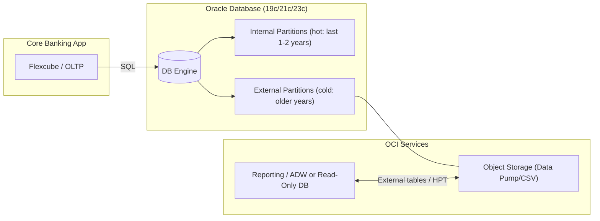

# Write History with the Future in Mind: Modernizing ACTB_HISTORY for the Cloud Era with Hybrid Partitioning

> Banking systems like Oracle Flexcube often accumulate massive volumes of transactional history due to regulatory data retention requirements. Core banking tables such as **ACTB_HISTORY** and **ACTB_ACCBAL_HISTORY** grow continuously, since purging old records isn’t an option when auditors or customers may request decade-old transactions. Over time, this ever-growing historical data becomes an expensive burden — it inflates backup storage, slows down restore/recovery, and consumes premium database storage while providing little day-to-day business value.

## Introduction

Oracle Database 19c introduced a game-changing feature to tackle this challenge: **Hybrid Partitioned Tables (HPT)**. This lets you split a single table’s partitions between regular internal storage and external files, including cheap cloud storage. In practice: keep recent “hot” data in the database for fast access, while offloading cold historical partitions to low-cost storage like **Oracle Cloud Infrastructure (OCI) Object Storage** — without deleting or losing access to any data. The goal here is to show how HPT optimizes data management in banking applications, preserving full query access to historical data at a fraction of the cost and complexity of traditional archiving.

## Challenges in Managing Historical Banking Data

Banks must retain years of transactional data (often 7-10+ years) to meet regulatory and auditing mandates. In practice, that means tables like **ACTB_HISTORY** continuously accumulate records from daily core banking operations. Key challenges:

- **Exploding data volumes**: tables can reach billions of rows, making routine maintenance and indexing difficult.  
- **Backup and recovery overhead**: backups get longer and heavier; cloning to non-prod becomes cumbersome.  
- **Performance impact**: old records are rarely accessed online, but their presence can still impact performance.  
- **Regulatory constraints**: purge isn’t an option; data must remain queryable on demand for audits and inquiries.

Traditional archiving (export + purge) complicates retrieval when auditors need data. HPT changes that.

## What Are Hybrid Partitioned Tables?

**Hybrid Partitioned Tables** extend Oracle’s partitioning by allowing some partitions to reside in the database (**internal**) and others to reside outside (**external**). In one table, you get recent partitions as normal segments for high-performance OLTP, while older partitions are pointers to files (CSV/Data Pump dumps) on inexpensive storage tiers. Oracle exposes both as a single, unified table to queries.

**Key aspects:**

- **Partitioning strategies**: RANGE or LIST (composite also possible), e.g., partition by year.  
- **External formats**: text/CSV via `ORACLE_LOADER`, binary dumps via `ORACLE_DATAPUMP`, and others.  
- **Read-only external partitions**: ideal for archive data; DML is blocked (ORA-14466).  
- **Seamless queries**: SQL spans internal and external partitions transparently.  
- **At least one internal partition** is required as an anchor.

Behind the scenes, Oracle stores metadata (file paths, etc.) in the data dictionary. External files can live on-prem filesystems (NFS/ACFS) or cloud object storage (e.g., OCI).

## Cost Optimization with OCI Object Storage

Moving cold data to **OCI Object Storage** yields dramatic savings: keeping data in active DB storage is far pricier than object storage. Most queries (≈80%) hit only recent “hot” data, so the performance trade-off for archived partitions is acceptable, especially for reporting/audit workloads. Backups shrink, clones get faster, and you can even apply lifecycle management (e.g., archive tier) to rarely accessed files.

On-prem? You can still leverage hybrid partitions with local filesystems; many banks adopt a hybrid-cloud approach where archives sit in OCI while OLTP remains on-prem. DBMS_CLOUD can bridge access securely.

## Implementation in a Banking Scenario

Consider **ACTB_HISTORY** (transaction history). Use yearly partitions: keep recent years internal; offload older years to OCI as **Data Pump** files.

```sql
CREATE TABLE ACTB_HISTORY (
  AC_ENTRY_SR_NO NUMBER,
  TRN_REF_NNO    VARCHAR2(20),
  AC_BRANCH      VARCHAR2(3),
  AC_NO          VARCHAR2(20),
  TRN_DT         DATE,
  FCY_AMOUNT     NUMBER(22,3),
  -- ... other columns ...
  CONSTRAINT PK_ACTB_HISTORY PRIMARY KEY (AC_ENTRY_SR_NO) ENABLE
)
PARTITION BY RANGE (TRN_DT) (
  PARTITION p_2021 VALUES LESS THAN (DATE '2022-01-01'),
  PARTITION p_2022 VALUES LESS THAN (DATE '2023-01-01'),
  PARTITION p_2023 VALUES LESS THAN (DATE '2024-01-01'),
  PARTITION p_2024 VALUES LESS THAN (DATE '2025-01-01')
)
-- Hybrid concept: keep recent partitions internal; attach older ones as external locations.
-- Actual DDL varies by version; treat below as a pattern to illustrate:
/*
ALTER TABLE ACTB_HISTORY MODIFY PARTITION p_2021
  EXTERNAL LOCATION ('https://objectstorage.../actb_history_2021.dmp') ACCESS PARAMETERS (ORACLE_DATAPUMP);
ALTER TABLE ACTB_HISTORY MODIFY PARTITION p_2022
  EXTERNAL LOCATION ('https://objectstorage.../actb_history_2022.dmp') ACCESS PARAMETERS (ORACLE_DATAPUMP);
*/
```
This keeps 2023–2024 internal (hot) and 2021–2022 external (cold). Applications keep using the same table — Oracle fetches from the right partition automatically. Add new yearly partitions as time advances; script conversion of older ones to external.

**Migrating existing data:** Export the target partition to a Data Pump file in OCI, then `ALTER TABLE ... MODIFY PARTITION ... EXTERNAL` to attach it. After validation, drop the internal segment to free space.

## Architecture Overview

Below is a simple Mermaid diagram of the reference architecture.


*Data flows:* hot queries hit internal partitions; historical queries stream from Object Storage via external partitions. Reporting systems can query the same historical files without duplicating data.

## Benefits, Best Practices, and Key Use Cases

**Benefits**
- **Cost savings** (often 50–80% for historical storage).  
- **Compliance** with everything still online and queryable.  
- **Lean prod DB**: shorter backups, faster maintenance.  
- **Faster migrations**: move history ahead of cutover; update pointers later.  
- **Unified access control**: no separate archive DB.  
- **Tier flexibility**: on-prem FS, OCI Standard, Archive tiers.  
- **Enhanced reporting**: share historical data with analytics directly from object storage.

**Best practices**
- Partition by **time** (year/quarter); keep current partitions internal.  
- Prefer **Data Pump** (`ORACLE_DATAPUMP`) for efficient, exact, compressed archives.  
- **Automate** archival (ILM/ADO jobs) to externalize old partitions on schedule.  
- **Monitor** external access; adjust how many years remain internal.  
- **Secure** credentials and files (DBMS_CLOUD credentials, OCI ACLs, encryption).

## Conclusion

For data-intensive banking, **Hybrid Partitioned Tables** provide an elegant, cost-effective way to turn historical data into an **online archive** — hot data stays fast, cold data gets cheaper, and everything remains a single SQL away. It aligns with banking IT goals: compliance, cost control, and reduced operational complexity — without sacrificing accessibility.
