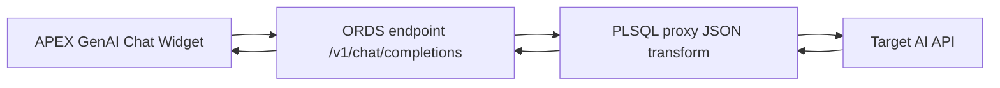
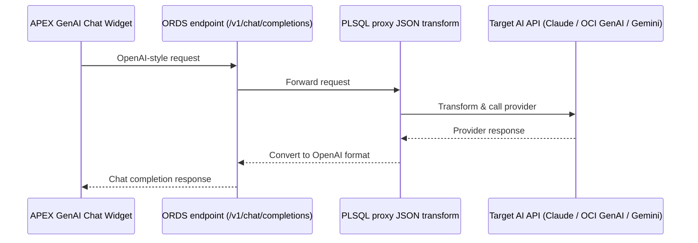

# Bringing Claude (and Any Model) into Oracle APEX Low-Code Chat Widgets — Without Third-Party Routers

Oracle APEX’s GenAI Dynamic Actions make it effortless to drop an AI chat widget into your app.  
The catch? They’re hard-wired for **OpenAI’s API schema**.  
If your favorite model—say Anthropic’s Claude—uses a different JSON format, it won’t plug in directly.

I ran into this exact roadblock… and found a clean workaround.  
With one small PL/SQL proxy layer, you can keep APEX’s low-code experience **and** talk to **any** API — all without signing up for third-party routing services or sharing your API keys outside your control.

---

## The Problem

- APEX GenAI DA sends payloads to the `/v1/chat/completions` endpoint in **OpenAI format**.
- Claude (and most non-OpenAI models) expect a **different endpoint and JSON schema** (`/v1/messages` for Anthropic).
- No setting exists to override the request/response format in the low-code GenAI DA.
- Services like OpenRouter or Together AI can wrap Claude in an OpenAI-compatible API — but they require you to **use their API keys** and bill through them.  
  I wanted **full control** over my keys and usage.

---

## The Workaround

Instead of changing the APEX widget or paying for a middleman, **make the API look like OpenAI** yourself.

We’ll:
1. Create a **PL/SQL package** that:
   - Receives OpenAI-style requests from the DA.
   - Transforms them to the target model’s request format.
   - Sends them using `APEX_WEB_SERVICE` with **your own API key**.
   - Transforms the model’s response back into OpenAI’s shape.
2. Expose that package through **ORDS** at `/v1/chat/completions`.
3. Point the APEX GenAI DA to your ORDS endpoint instead of api.openai.com.

---

## How It Works

### Before
```
APEX Chat Widget -> OpenAI API -> GPT model
```

### After
```
APEX Chat Widget -> ORDS Proxy -> Target AI API
```

The DA still thinks it’s talking to OpenAI, but the proxy does the translation behind the scenes — **with zero third-party dependency**.

---

## Architecture Diagram (Flowchart)



---

## Architecture Diagram (Sequence)



---

## Key Code

You’ll find the full working package and ORDS handler in my GitHub repo (link below).  
Highlights:

- **Native JSON parsing**: Uses `JSON_OBJECT_T` / `JSON_ARRAY_T` instead of `APEX_JSON` for cleaner, standard parsing.
- **APEX_WEB_SERVICE**: Handles outbound HTTPS with your APEX credentials; no `UTL_HTTP` wallet headaches.
- **Configurable model & tokens**: Pass `max_output_tokens`, `temperature`, etc., through your proxy.

Example call in the proxy:
```plsql
APEX_WEB_SERVICE.ADD_REQUEST_HEADER('x-api-key', l_api_key);
APEX_WEB_SERVICE.ADD_REQUEST_HEADER('anthropic-version','2023-06-01');
l_resp_clob := APEX_WEB_SERVICE.MAKE_REST_REQUEST(
  p_url         => 'https://api.anthropic.com/v1/messages',
  p_http_method => 'POST',
  p_body        => l_body.to_clob()
);
```

---

## Choosing the Right Claude Model

For **general-purpose chat + content creation** with JSON analysis:
- **claude-opus-4-1-20250805** – highest quality, deepest reasoning.
- **claude-sonnet-4-20250514** – great balance of quality and speed.
- **claude-3-7-sonnet-20250219** – solid hybrid reasoning, lower cost.

---

## Works with OCI Generative AI Agents Too

Oracle’s official blog *Integrating OCI Generative AI Agents with Oracle APEX Apps for RAG-powered Conversational Experience* demonstrates a different approach:  
They use **low-level REST API calls** directly to OCI Generative AI and render messages in a **classic report** to mimic a chat experience.

That works well, but it’s still a **custom UI** — you build and maintain the conversation rendering logic yourself.

With this proxy method, you can:
1. Keep the **APEX GenAI Dynamic Action chat widget** for a true low-code UI.
2. Point it to your ORDS proxy.
3. Have the proxy map the OpenAI-style request to the OCI Generative AI API format (with OCI auth, `modelId`, and `input`).
4. Map the OCI response back into the OpenAI `chat/completions` shape.

You get:
- The same RAG-powered intelligence from OCI Generative AI.
- Zero custom UI code.
- Full control over authentication and model switching.

---

## Why This is Powerful

- **No UI rewrites** – keep using the low-code chat widget.
- **Model agnostic** – works for Claude, OCI GenAI, Gemini, Mistral, or any API.
- **Full control** – you never hand over your API key to a third-party router.
- **Central control** – one place to add logging, prompt tweaks, or safety filters.

---

## Next Steps

1. Clone the repo from [*GitHub link here*].
2. Import the package into your APEX schema.
3. Create the ORDS module/handler.
4. Point your GenAI DA’s endpoint to your proxy URL.

You’ve now extended APEX’s low-code AI to **any model**, securely and without intermediaries.

---

### Bonus Idea

You can extend the proxy to:
- Route requests dynamically (OpenAI for quick chats, Claude for deep reports, OCI GenAI for enterprise data).
- Add guardrails (token limits, banned phrases).
- Log all prompts/responses for analytics.
